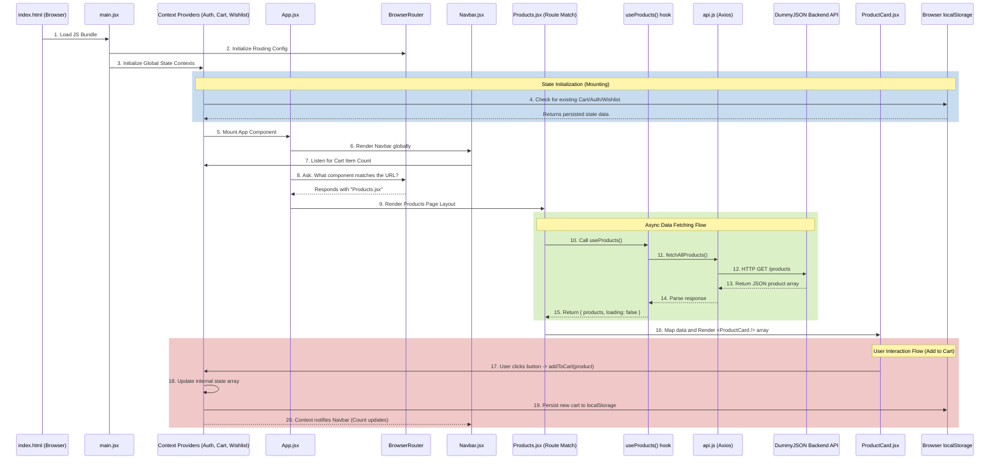

# UrbanCart - Architecture & Concept Documentation

Welcome to the architectural overview of **UrbanCart**. This document provides a highly detailed explanation of each module, its purpose, how components are segregated, and the overarching data flow governing the application.

---

## 1. Application Entry & Configuration (`main.jsx` & `App.jsx`)

### `main.jsx`
This is the root entry point of the React application. 
- **Responsibilities:** 
  - Mounts the application to the DOM (`root` element).
  - Configures the application routing via `BrowserRouter` with a specific basename (`/URBAN-CART`) to support GitHub Pages hosting.
  - Wraps the entire application tree with the global Context Providers (`AuthProvider`, `CartProvider`, `WishlistProvider`) to make global state available to every deeply nested component.

### `App.jsx`
This serves as the central layout wrapper and routing engine of the app.
- **Responsibilities:**
  - **Routing Engine:** Employs `react-router-dom` (`Routes` & `Route`) to dictate which Page component renders based on the browser's URL path (e.g., `/cart`, `/checkout`, `/products/:id`).
  - **Core Layout:** Contains elements visible across all routes, notably the `Navbar`.
  - **Global Overlays:** Conditionally handles global UI states like the `Loader` component (during initial mounting) and the `ToastContainer` (for displaying success/error popup notifications).

---

## 2. Context Layer (`src/context/`)
The Context layer manages global state that needs to be accessed and mutated by disparate, unlinked components without "prop-drilling."

### `AuthContext.jsx`
- **Purpose:** Manages the authentication state of the user.
- **Mechanics:** Retrieves previously saved login states from `localStorage` during its initial mount. Exposes a `user` object containing session info, alongside `login(name, email)` and `logout()` functions. State updates automatically synchronize with `localStorage`.

### `CartContext.jsx`
- **Purpose:** Controls the user's shopping cart global state.
- **Mechanics:** Keeps track of an array of products added to the cart, holding data such as quantities and item details. Exposes functions like `addToCart`, `removeFromCart`, `updateQuantity`, and `clearCart`. It syncs directly with `localStorage` so users don't lose cart items on page refresh.

### `WishlistContext.jsx`
- **Purpose:** Manages the user's saved/favorited items.
- **Mechanics:** Conceptually similar to the Cart Context, preserving a list of product IDs/details that the user "liked". Also linked to `localStorage` for data persistence across sessions.

---

## 3. Custom Hooks (`src/hooks/`)
Hooks encapsulate and re-utilize complex logic so components remain clean and focused on rendering UI.

### `useProducts.js`
- **Purpose:** Handles fetching main product data and product categories from the API.
- **Mechanics:** Executes an async effect on mount using `Promise.all` to fetch both products and categories from `api.js`. It filters out empty categories and holds `loading`, `error`, `products`, and `categories` state flags which it returns to whatever component calls it (like the `Products` page).

### `useCart.js` & `useWishlist.js`
- **Purpose:** Wrapper hooks allowing faster, error-safe access to their respective contexts. 
- **Mechanics:** Calls `useContext(CartContext)` inside. If a component uses this hook outside the provider, it throws a helpful developer error.

### `useDebounce.js`
- **Purpose:** Performance optimization hook limit the rate of function execution.
- **Mechanics:** Delays processing of fast-changing values (like search bar text input) until the user stops typing for a specified number of milliseconds. This prevents an API call or expensive filter operation from triggering on every single keystroke.

---

## 4. Services & API Connections (`src/services/`)
This segment isolates network requests and third-party API communication.

### `api.js`
- **Purpose:** The dedicated fetch-layer configuration connecting to external backends (`DummyJSON`).
- **Mechanics:** Utilizes `axios`. Configures a base `axios` instance with the `BASE_URL = 'https://dummyjson.com'`. Exports isolated asynchronous functions like `fetchAllProducts()`, `fetchCategories()`, and `fetchProductById(id)`. This abstraction ensures components don't care *how* data is fetched, only that they get the results.

---

## 5. Application Pages (`src/pages/`)
Pages are top-level "view" components tied directly to specific Route paths in `App.jsx`.

### `Home.jsx` (`/`)
Landing page featuring promotional banners, category highlights, and featured product displays.

### `Products.jsx` (`/products`)
The core shopping page. It queries data using `useProducts()`, applies filtering using the `Filters` component, and iterates out the `ProductGrid`.

### `ProductDetails.jsx` (`/products/:id`)
A dynamically routed page that captures the `:id` parameter from the URL, uses it to fetch specific data for a single product, and gives a detailed view, image gallery, and larger "Add to Cart" interactions.

### `Cart.jsx` (`/cart`) & `Wishlist.jsx` (`/wishlist`)
Checkout preparation pages that consume the `CartContext` and `WishlistContext` to dynamically construct lists showing items the user intends to save or purchase. Includes dynamic pricing subtotal calculations.

### `Checkout.jsx` (`/checkout`)
The final data-collection page collecting shipping, and billing information (or integrating with Formspree). Often interacts closely with `AuthContext` to auto-fill logged-in user information.

---

## 6. Reusable Components (`src/components/`)
"Dumb" or localized interactive components responsible solely for UI structure and styling blocks.

- **`Navbar.jsx`:** The persistent top navigation bar. Includes routing links, mobile menu togglers, and badge indicators for Cart/Wishlist counts.
- **`ProductGrid.jsx` & `ProductCard.jsx`:** The grid layout component that takes an array of product objects, rendering an individual styled `ProductCard` for each one (housing the image, price, and immediate action buttons).
- **`Filters.jsx` & `SearchBar.jsx`:** Interactive components that take in user input, usually passing values back up to parent components (like `Products.jsx`) to update what is rendered on screen.
- **`LoginModal.jsx`:** Provides a modular UI popup designed to interface with Formspree or custom login logic before allowing users onto protected layers like Checkout.
- **`Loader.jsx`:** Visual feedback component displaying a spinning graphic or skeletal layout when async operations are still loading from the API.
- **`ThankYouCard.jsx`:** A generic success states component rendered after an order process completes.

---

## 7. Utility Functions (`src/utils/`)

### `helpers.js`
- **Purpose:** Pure functions for mundane repeatable calculations without needing React logic. 
- **Mechanics:** Examples include currency formatting abstractions, string truncation, percentage-off discounts calculation engines.

---

## 8. Application Data Flow & Execution Sequence

Below is a detailed Mermaid flowchart visualizing exactly what happens when the app loads and a user navigates to the products page to add an item to their cart.

### Explaining the Execution Order:

1. **Bootstrap Phase:** The user's browser parses `index.html` which executes `main.jsx`.
2. **Context Wrapping:** `main.jsx` wraps the application in the Contexts. The Contexts mount and immediately peek into the browser's `localStorage` to hydrate their states (e.g., pulling out "User is logged in" or "Cart has 2 items").
3. **App Wiring:** `App.jsx` mounts, laying out the baseline layout interface (`Navbar`, `ToastContainer`). 
4. **Route Matching:** `Routes` evaluates the browser URL. If the user is on `/products`, it tells the DOM to place the `Products.jsx` component inside the main container.
5. **Data Hydration:** `Products.jsx` mounts and invokes the `useProducts` hook. The hook fires off `fetchProducts()` which requests data from `api.js()`, calling the external servers. (Meanwhile, `Products.jsx` displays the `Loader` component).
6. **Data Presentation:** External data arrives, `loading` flags set to false. The `Products.jsx` component iterates over the parsed data, spawning individual `ProductCard` components via the `ProductGrid`. 
7. **Interactivity:** A user clicks "Add to Cart" on a `ProductCard`. This fires a deeply nested function linked back to the `CartContext.jsx`. The context state updates, fires a sync to `localStorage`, and all components subscribed to `CartContext` (like the Badge over the Cart Icon in the `Navbar`) instantly re-render accurately.
